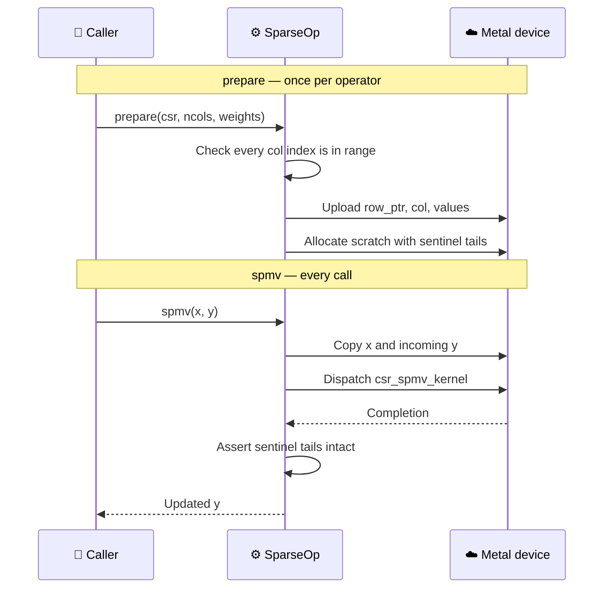
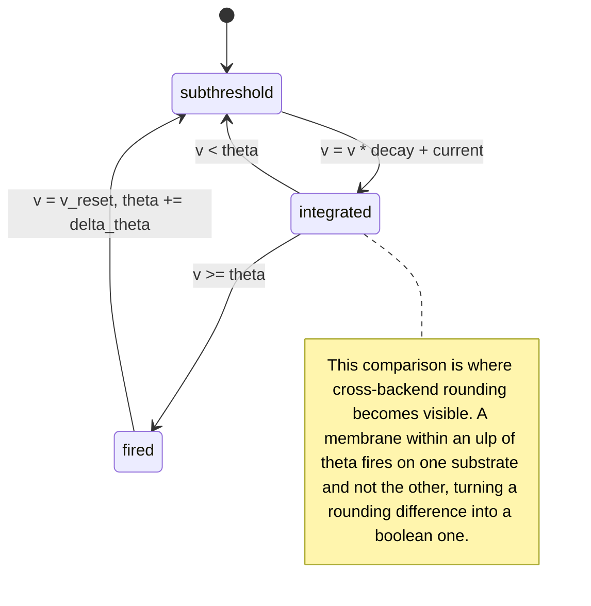
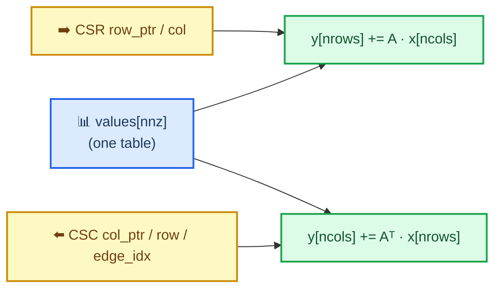

# sparsl

Deterministic sparse and scan compute kernels for event-driven simulation, with fail-closed CPU and GPU backends.

Extracted from the numeric core of a spiking-network research harness. The kernels themselves are small and unglamorous — CSR sparse matrix-vector multiply, a leaky integrate-and-fire membrane update, a chunked prefix scan over affine maps, structure-of-arrays column buffers, a seeded RNG. What the crate is about is the two properties those kernels are held to: **results you can reproduce bit for bit**, and **a backend handle that cannot lie about where it ran**.

| | |
| --- | --- |
| **Status** | `0.1.0` — Metal verified, CUDA declared but unavailable |
| **Tests** | 56 passing; suite verified by a 20-case mutation campaign |
| **Platform** | Any CPU; Metal on macOS behind `--features metal` |
| **License** | MIT OR Apache-2.0 |

---

## 🗂️ Architecture

Every path to a kernel runs through two gates. A `Device` exists only for a substrate that can execute, and a `SparseOp` exists only for connectivity validated against its column count. Neither an unavailable backend nor an unchecked sparse matrix is reachable from the public API — both are error values, not runtime surprises.


| Module | What it holds |
| --- | --- |
| `backend` | `Device`, `SparseOp`, availability, validation, CPU kernels |
| `backend::metal` | Metal device, pipelines, resident buffers, dispatch |
| `backend::cuda` | Why CUDA is declared and never available, and how to land it |
| `sparse` | `Csr` and its `Csc` reverse index |
| `scan` | Chunked prefix scan over affine maps, bit-exact against sequential |
| `simd` | Lane-shaped leak/integrate, no intrinsics, no `unsafe` |
| `buffer`, `rng`, `time` | SoA columns, seeded ChaCha, tick type |

---

## 🛡️ The honesty invariant

`Device::label()` reports the substrate that **executed**, not the one that was requested. There is no fallback: asking for an unavailable backend returns `BackendUnavailable` with a reason.

This is a regression guard, not decoration. The code this crate was extracted from carried a `use_gpu: bool` that no dispatch path ever read. A "GPU" handle and a "CPU" handle ran byte-identical `rayon` code, benchmarks reported roughly 1.00x speedups as genuine cross-substrate results, and generated reports printed CPU timings under a GPU heading.


One gate serves every backend, and that is deliberate. An earlier version gave each backend its own error arm; a mutation replacing one arm's `Err` with a CPU fallback passed the entire test suite, because on a machine where Metal works that arm is unreachable and no test on such a machine can execute it. Untestable code is not made safe by more tests, so the branch was removed rather than covered.

### Backend status

| Backend | Availability | Notes |
| --- | --- | --- |
| `CpuSequential` | Always | The determinism reference |
| `CpuParallel` | Always | Asserted **bit-identical** to sequential, not merely close |
| `Metal` | `--features metal`, macOS, real device | Implemented and verified against the reference |
| `Cuda` | **Never** | No dispatch written; none could be verified on Apple silicon |

`Backend::Cuda` fails closed with a reason and is omitted from `available_backends()`. `src/backend/cuda.rs` carries the steps to land it; the last one is that `tests/differential.rs` fuzzes any backend the moment it reports available, so that flag must not be flipped before the suite passes.

---

## ⚙️ How a dispatch works

Connectivity and weights are uploaded once. Only the input vector and the membrane state cross the boundary per call.



Two decisions in that diagram were forced by measurement rather than taste.

**Weights belong to the operator.** As a per-call argument they forced an 80 MB host-to-device copy before every dispatch on a 20M-non-zero operator, and Metal lost to `rayon` at every size on that copy alone. Moving them onto the operator took the 20,000-row case from 3.03 ms to 1.01 ms.

**Column indices are validated once, then trusted.** The GPU kernels index `x[col[i]]` with no range check, because a bounds check per non-zero costs more than the multiply it guards. That is sound only because `prepare` proves every stored index is in range before a byte is uploaded, and preparing is the only route to a sparse kernel. An out-of-range `Csr` is a rejected `SparsePlanError`, never an out-of-bounds read of device memory.

---

## 🔬 What the kernels compute

Each tick a cell decays its membrane, adds synaptic current, and either stays below threshold or fires — resetting the membrane and raising its own threshold.



That note is the reason the differential suite treats spikes inside a tolerance band around threshold as legitimately ambiguous, and demands exact agreement everywhere else.

### The scan, on both substrates

`Device::assoc_scan` runs the affine-map scan on whichever substrate the handle names — and this is the one primitive where the arms deliberately disagree.

The CPU arms are bit-identical to a sequential left-fold. They buy that by making phase 1 a *complete* sequential fold, roughly `2n` combines to replace `n`, measured at 1.08x. The Metal arm is a two-level Hillis-Steele scan that reassociates, so it is genuinely parallel and is **not** bit-identical to the CPU arms.

That is the rule this crate already states, not an exception to it: reproducibility holds *within* a backend and never across one. Two runs on the same device agree byte for byte. If you need output bit-identical to the sequential fold, ask for a CPU backend — a GPU one cannot give it, and `Device::assoc_scan` says so in its docs rather than by silently differing.

Correctness rests on two exact tests rather than a tolerance. With `a = 1, b = 1` every prefix is exactly `i + 1`; with `a = 2, b = 0` every prefix is exactly `2^(i+1)`. Both are integers f32 represents exactly, so a misapplied block offset is plainly wrong with nowhere to hide — which matters, because a tolerance derived as `n · eps · max` is around 10% at n = 100000 and absorbs almost anything.

### The batched product

`SparseOp::spmm` computes `Y += A · X` for `n_vec` dense vectors in one dispatch.

A single-vector SpMV performs one multiply-add per index it loads, which is not enough arithmetic to cover the load — that is why the GPU arm needs a large problem before it overtakes rayon at all. Batching reuses each `weights[i]` and each `col[i]` across every vector, which is a change in arithmetic intensity rather than in parallelism.

`x` and `y` are **batch-minor**: `x[c * n_vec + v]` is column `c` of vector `v`. That is the opposite of storing each vector contiguously, and it is the entire point — adjacent GPU threads then differ only in `v`, so they read adjacent addresses, write adjacent addresses, and share the same `col[i]` sequence as a broadcast. Batch-major storage turns all three into scattered access.

A batch of one is **bit-identical** to `spmv` on every backend, not merely within tolerance. Both dispatch to the same scalar path, and the test asserts equality of raw bit patterns — which fails on any reassociation or stray fused multiply-add that a tolerance would absorb.

| n | nnz | n_vec | repeated `spmv` (ms) | `spmm` (ms) | same-backend speedup |
|---:|---:|---:|---:|---:|---:|
| 1,000 | 50K | 8 | 2.360 | 0.247 | **9.6×** |
| 1,000 | 50K | 32 | 8.009 | 0.355 | **22.5×** |
| 5,000 | 1.25M | 8 | 3.013 | 0.358 | **8.4×** |
| 5,000 | 1.25M | 32 | 10.926 | 0.945 | **11.6×** |
| 10,000 | 5M | 32 | 19.106 | 1.464 | **13.1×** |

Metal GPU, `cargo run --release --features metal --example batch_crossover`. These compare `spmm` against `n_vec` separate `spmv` calls **on the same backend**, so machine load affects both arms alike. Cross-backend numbers are deliberately absent: they were taken at load average 49, where the rayon arm is contending for cores and Metal is not, and a crossover measured under that says more about the machine than the kernels.

### The transposed product

`SparseOp::spmv_t` computes `y += Aᵀ · x` — the direction a gradient travels. Given `dy` over a sparse layer's outputs it produces `dx` over its inputs, which is what a learning rule needs and what a forward-only SpMV cannot give.

It walks a CSC reverse index rather than materialising `Aᵀ`. Each CSC entry names the CSR row it came from and the slot its value occupies in the *forward* weight table, so one value table serves both directions and `set_weights` updates them together — there is no second copy to fall out of step.



The reverse index costs as much memory as the forward one, so it is opt-in: build the operator with `Device::prepare_with_transpose`. An operator from `Device::prepare` returns `OpError::TransposeNotPrepared` rather than building one implicitly, because a method that silently doubles an operator's footprint the first time it is called is worse than one that says it cannot.

Correctness is gated on the inner-product identity `⟨A·x, y⟩ == ⟨x, Aᵀ·y⟩`, which is the definition of the transpose. A wrong-but-plausible implementation — indices swapped, the weight table read by CSC position instead of `edge_idx` — still looks like a sparse product and still fails that identity. Both mutations were injected and both were caught.

---

## 🎯 Reproducibility, and where it stops

Same seed, same backend, same bits. The parallel scan left-folds instead of reassociating specifically so it matches a sequential scan bit for bit, and the two CPU arms are asserted bit-identical. Nothing here autotunes: a kernel picked by runtime benchmark differs per machine, which changes the reduction order, which changes the floats.

Across backends it does not hold. The crate names the three causes rather than implying they do not exist.

| Cause | Effect | Covered by |
| --- | --- | --- |
| Reduction order | GPU and CPU row sums differ in the last ulps | `tolerance_for_nnz_per_row`, the `n · eps · max|term|` bound with margin |
| Multiply-add contraction | Metal fuses `v * decay + current`, rounding once where the CPU rounds twice | `tolerance_for_elementwise`, pinned by `tests/fma_contraction.rs` |
| Threshold proximity | Either of the above can flip a spike, not merely perturb a float | Spike flips permitted only inside the tolerance band |

`CompileOptions::set_fast_math_enabled(false)` does **not** prevent the contraction — that was measured, not assumed. `tests/fma_contraction.rs` requires every non-spiking GPU membrane to match one of the two roundings bit for bit, so the tolerance is sized for an identified cause rather than for an unexplained gap.

`tests/golden.rs` pins the reference's actual output bits. Any change to summation order, iteration order, the RNG, or the LIF update moves the fingerprint — which is exactly the signal that a downstream replay hash has become invalid.

---

## 📦 Usage

```toml
[dependencies]
sparsl = { version = "0.1", features = ["metal"] }
```

```rust
use sparsl::{Backend, Csr, Device, LifParams};

fn main() -> Result<(), Box<dyn std::error::Error>> {
    let csr = Csr::from_adjacency(&[vec![1, 2], vec![0], vec![0, 1]]);
    let weights = vec![1.0, 2.0, 3.0, 4.0, 5.0];

    // Prefer the GPU, but never silently pretend to have one.
    let device = Device::try_new(Backend::Metal).unwrap_or_else(|why| {
        eprintln!("falling back to CPU: {why}");
        Device::cpu_parallel()
    });

    // Validates the CSR against ncols and uploads it once.
    let mut op = device.prepare(&csr, 3, &weights)?;

    let x = vec![0.5, 1.0, 1.5];
    let mut y = vec![0.0; 3];
    op.spmv(&x, &mut y)?;

    let params = LifParams::new(0.9, 0.0, 0.1)?;
    let (mut v, mut theta, mut spikes) = (vec![0.0; 3], vec![1.0; 3], vec![false; 3]);
    op.fused_spmv_lif(&x, &mut v, &mut theta, &mut spikes, params)?;

    // Connectivity is fixed; values move on the timescale of learning.
    op.set_weights(&[1.0, 2.0, 3.0, 4.0, 6.0])?;

    println!("ran on {}", op.label());
    Ok(())
}
```

This snippet is `examples/readme.rs`, built on every check so it cannot drift from the crate. Run it without `--features metal` and it prints the invariant working:

```text
falling back to CPU: backend `Metal GPU` is unavailable: sparsl was built without the `metal` cargo feature
ran on CPU parallel (rayon)
```

---

## 📊 Performance

`cargo run --release --features metal --example crossover` — Apple M5 Pro, CSR at 5% density, milliseconds per SpMV. Fastest arm per row in bold.

| N | nnz | CPU sequential | CPU parallel | Metal |
| ---: | ---: | ---: | ---: | ---: |
| 1,000 | 50K | **0.022** | 0.109 | 0.187 |
| 5,000 | 1.25M | 0.718 | 0.278 | **0.239** |
| 10,000 | 5M | 3.048 | **0.388** | 0.491 |
| 20,000 | 20M | 12.496 | 1.239 | **1.007** |

Read this cautiously. The example exercises every arm before timing any of them — without that ramp the first-timed arm pays for the GPU clock ramp-up and later arms do not, which once produced the physically impossible result that adding a host memcpy per iteration made it faster. It then times each arm twice in opposite orders and reports the spread between passes; the spread here was 1.24 to 1.66, so the `rayon` and Metal ordering at 10,000 rows is inside the noise.

The honest summary: `rayon` wins the middle of the range, Metal pulls ahead at the top by a margin that is not large, and below roughly 5,000 non-zeros per row the sequential arm beats both because neither parallel substrate earns its dispatch overhead.

### narrow weights buy less than the arithmetic suggests

`cargo run --release --features metal --example narrow_crossover` — the weights are stored 16-bit and the kernel widens them on load. Three runs, each arm timed in both orders and averaged over 20 dispatches:

| n | nnz | f32 | binary16 | bfloat16 |
| ---: | ---: | ---: | ---: | ---: |
| 10,000 | 5M | 0.46–0.49 ms | 1.14–1.29x | 1.08–1.35x |
| 20,000 | 20M | 1.28–1.39 ms | 1.07–1.11x | 1.03–1.08x |
| 50,000 | 20M | 1.70–1.89 ms | 1.02–1.15x | 1.06–1.18x |

The two narrow formats are indistinguishable from each other, which is what should happen: both store 2 bytes, so they move identical traffic. **Choose between them on numerics, never on speed.**

This table used to predict "a straight 2x". That was wrong twice over.

First, the arithmetic. The kernel streams `col_ind` (4 bytes) *and* `values` (4 bytes) per non-zero, so narrowing only the values takes traffic from 8 bytes to 6. The ceiling is 1.33x, not 2x.

Second, even 1.33x is not reached, and the likely reason is the term neither figure counts: `x[col_ind[i]]` is a random gather, its cost is unchanged by narrowing the weights, and it is a large share of the real work. Supporting rather than proving that: the win is largest at n = 10,000, where `x` is 40 KB and gather-friendly, and smallest at n = 50,000, where it is 200 KB.

So narrow storage is worth a few percent here, not a doubling. It ships because the derivation it forced — [`tolerance_for_spmv_narrow`](src/backend/mod.rs) — is what was actually blocking narrow types, and it is one formula parameterised by the format's epsilon rather than one per format.

### bitpacked spikes: the operand that was actually worth narrowing

`cargo run --release --features metal --example spike_crossover` — `SparseOp::spmv_spikes` takes 32 spikes per `u32` instead of one `f32` each. Three runs, both orders, averaged over 20 dispatches:

| n | `x` dense | `x` packed | dense | packed | speedup |
| ---: | ---: | ---: | ---: | ---: | ---: |
| 10,000 | 39 KB | 1.2 KB | 0.46–0.52 ms | 0.48–0.51 ms | 0.90–1.07x |
| 20,000 | 78 KB | 2.4 KB | 1.28–1.33 ms | 1.15–1.25 ms | 1.04–1.11x |
| 50,000 | 195 KB | 6.1 KB | 1.60–1.67 ms | 1.13–1.26 ms | **1.30–1.48x** |

The win *grows* with `n`, which is the whole point and the opposite of a fixed saving. `x[col[i]]` is a random gather, so its cost is set by whether the vector fits in cache rather than by how much of it is streamed. At 39 KB the f32 vector already fits and packing only adds decode work — hence the sub-1.0x readings. At 195 KB it does not, and packing takes it to 6.1 KB.

This is also the measurement that explains the narrow-weight result above. Halving the weights moved streamed traffic and bought a few percent; the gather it left untouched is where the remaining cost was.

**Exact, not approximate.** Unlike narrow weights there is no tolerance here, and none is needed. A spike is 0 or 1, both exact in `f32`, and both paths decode the bit to a float and multiply — so `spmv_spikes` is bit-identical to `spmv` with the same spikes expanded. It is bit-identical *across backends* too, which the dense SpMV is not: the CPU/GPU gap there comes partly from Metal contracting `a*b + c` into one `fma`, and with a multiplier of exactly 0 or 1 the product is exact, so there is no intermediate rounding for contraction to skip.

---

#### Which narrow format

| | binary16 | bfloat16 |
| --- | --- | --- |
| layout | 1+5+10 | 1+8+7 |
| epsilon | 2⁻¹⁰, 8192x f32 | 2⁻⁷, 65536x f32 |
| largest finite | 65504 | 3.3895e38 |
| bound | `tolerance_for_spmv_f16` | `tolerance_for_spmv_bf16`, ~8x looser |

binary16 is 8x finer; bfloat16 reaches five orders of magnitude further before overflowing. Neither is a default. bfloat16 is *not* overflow-proof either — with 7 significand bits its largest finite value is 3.3895e38 against f32's 3.4028e38, so the top 0.4% of the f32 range, `f32::MAX` included, still rounds to infinity.

---

### The prefix scan is slower on Metal, and that is the finding

`cargo run --release --features metal --example scan_crossover` — same host, milliseconds for a full prefix scan over affine maps.

| n | CPU sequential | Metal | ratio |
| ---: | ---: | ---: | ---: |
| 0.1M | **0.09** | 0.72 | 0.13x |
| 0.3M | **0.39** | 1.56 | 0.26x |
| 1.0M | **1.61** | 4.38 | 0.37x |
| 4.2M | **6.47** | 14.38 | 0.45x |

`Backend::Metal` loses at every size. `scan.rs` used to predict the opposite — that a two-level tree scan "would deliver a real speedup" — and that prediction is simply wrong here. Composing two affine maps is three flops over sixteen bytes moved, so the operation is memory-bound, and the three-phase tree makes roughly five passes over memory where a sequential fold makes one. Bandwidth does not rescue an algorithm that spends it on extra passes.

The gap does narrow with `n` (0.13x to 0.45x), so the GPU is amortising fixed costs — it just does not reach parity anywhere in this range.

The kernel ships anyway, for one reason: `Backend::Metal` should be able to run every operation this crate offers rather than silently falling back to CPU under a GPU label, which is precisely what [`Backend::Cuda`](#backend-status) refuses to do. It is documented as slow at its call site so nobody reaches for it expecting a win.

---

## 🧪 Testing

```bash
cargo test --features metal --release
```

| Suite | Tests | What it holds down |
| --- | ---: | --- |
| Unit (in-crate) | 28 | Scan bit-exactness, CSR/CSC invariants, RNG golden stream, tolerance bounds |
| `honesty` | 6 | Unconstructible unavailable backends, distinct labels, CPU arms bit-identical |
| `differential` | 6 | Every available backend against the CPU reference, boundary shapes plus a proptest fuzz |
| `stress` | 13 | Malformed CSR, out-of-range columns, non-finite data, subnormals, contention, soak |
| `golden` | 2 | The reference's own output bits |
| `fma_contraction` | 1 | That the CPU/GPU gap has exactly one identified cause |

The shape sweep straddles every boundary the backends care about — 31, 32, 33 for the SIMD width and 255, 256, 257 for the threadgroup — plus the degenerate zero-row, zero-edge and single-row cases that a sweep of reasonable sizes never reaches.

### Mutation campaign

All thirteen stress tests passed on their first run, which is precisely when a suite deserves suspicion. Twenty deliberate defects were injected. **Four survived, and each exposed a real gap that was then closed:**

| Surviving mutation | What it exposed | Fix |
| --- | --- | --- |
| Delete the fused kernel's row bounds guard | Out-of-bounds device writes landed in page padding and were invisible | Sentinel tails on every kernel-written buffer, checked after each dispatch |
| Sum each row in reverse | Every check is relative to the reference, so moving the reference moves everything and nothing fails | `tests/golden.rs` pins the reference's bits |
| `try_new(Metal)` falls back to CPU | The error branch is unreachable on a machine that has Metal | One availability gate for all backends, plus a directly tested consistency check |
| Widen a tolerance to `f32::MAX` | A tolerance can fail upward and make an entire suite vacuous | Upper as well as lower bounds asserted on both tolerance formulas |

Re-verification after the fixes: every former survivor is now caught.

---

## 🧭 Known gaps

Recorded rather than implied. One entry left, and it is a decision rather than a shortfall. **SpMM shipped** — see [The batched product](#the-batched-product). The **`block 0.1.6`** entry is gone too: the Metal backend now uses `objc2-metal`, which does not depend on it, so the future-incompatibility lint that would have become a hard error no longer applies.

| Gap | Why it matters | Why not yet |
|---|---|---|
| **CUDA** | `Backend::Cuda` is declared and permanently unavailable. | Deliberate. See `src/backend/cuda.rs`: it refuses rather than silently falling back to CPU under a GPU label. |

---

## 🔗 Relationship to tessl

[`tessl`](https://github.com/bharathvbcr/tessl) is the dense counterpart — a Metal 4 GEMM and encode runtime built on `objc2-metal`, `MTL4` argument tables and TensorOps. `sparsl` is sparse and CPU-first. Both now build on `objc2-metal`: the gfx-rs `metal` crate pulled `block 0.1.6` at every version, which is unmaintained and trips a future-incompatibility lint, so the two crates share one binding stack.

They are deliberately separate crates. `tessl`'s runtime, dispatch and tensor modules form a general Metal 4 compute runtime that `sparsl` could eventually sit on, but folding sparse SpMV and LIF kernels into a GEMM crate would blur what either one is. If `sparsl` moves to Metal 4, it should depend on that runtime rather than merge into it.


---

## 📄 License

Dual-licensed under either of

- Apache License, Version 2.0 ([LICENSE-APACHE](LICENSE-APACHE))
- MIT license ([LICENSE-MIT](LICENSE-MIT))

at your option. Unless you explicitly state otherwise, any contribution intentionally submitted for inclusion in this crate shall be dual-licensed as above, without any additional terms or conditions.
