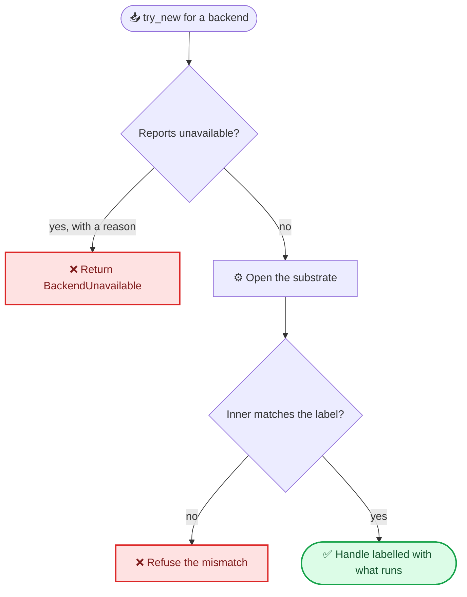
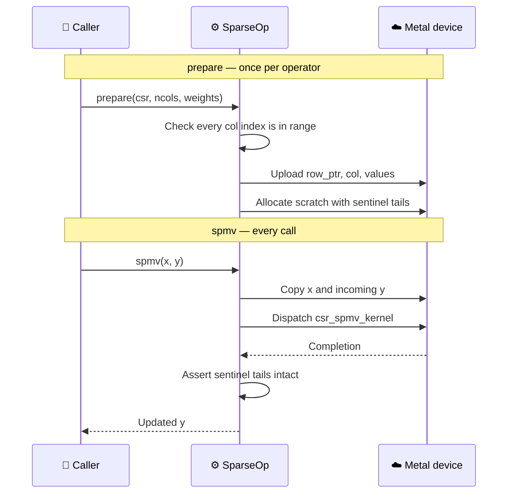
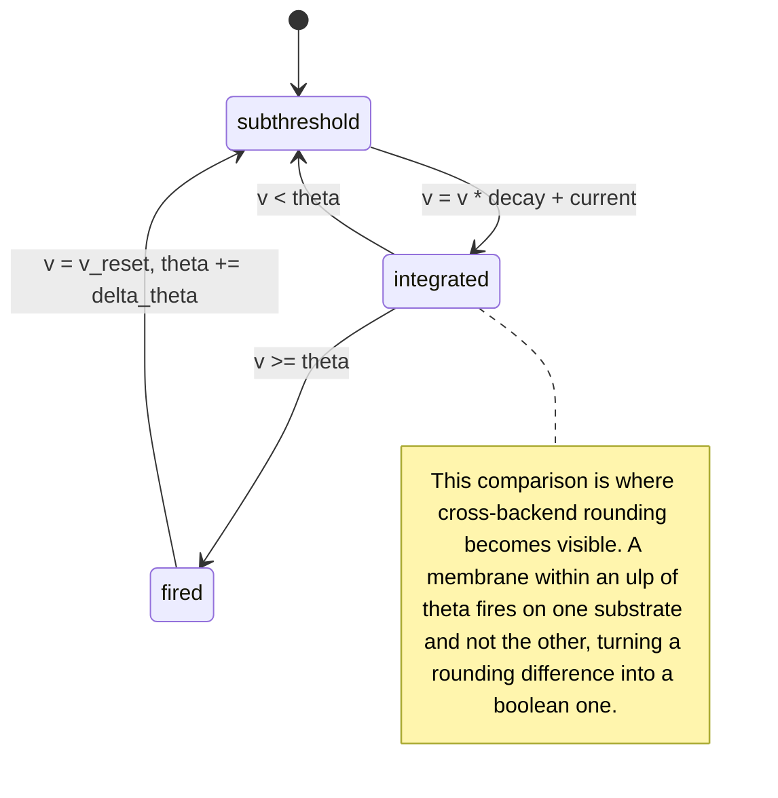
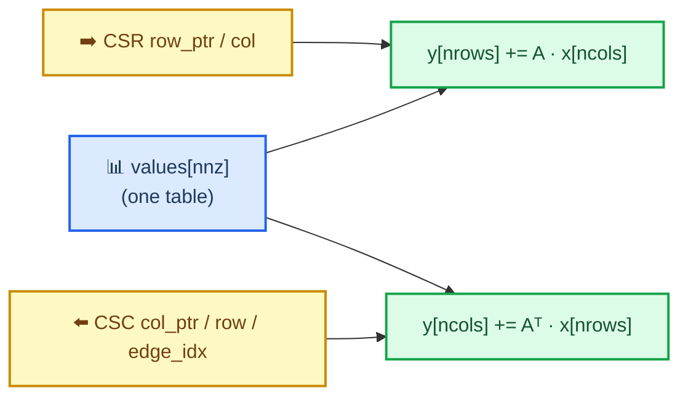

<p align="center">
  <picture>
    <source media="(prefers-color-scheme: dark)" srcset="assets/png/logo-dark@900.png">
    
  </picture>
</p>

<p align="center">
  <a href="https://sparsl.vbcr.dev/"></a>
  <a href="https://crates.io/crates/sparsl"></a>
  <a href="https://docs.rs/sparsl"></a>
  <a href="https://github.com/bharathvbcr/sparsl/actions/workflows/ci.yml"></a>
  
</p>

<p align="center">
  <a href="https://sparsl.vbcr.dev/"><strong>Interactive CSR Showcase (sparsl.vbcr.dev)</strong></a> ·
  <a href="https://docs.rs/sparsl"><strong>API documentation</strong></a> ·
  <a href="https://crates.io/crates/sparsl"><strong>crates.io</strong></a> ·
  <a href="CHANGELOG.md">Changelog</a> ·
  <a href="https://github.com/bharathvbcr/tessl">tessl, the dense counterpart</a>
</p>

Deterministic sparse and scan compute kernels for event-driven simulation, with fail-closed CPU and GPU backends.

Extracted from the numeric core of a spiking-network research harness. The kernels themselves are small and unglamorous — CSR sparse matrix-vector multiply, a leaky integrate-and-fire membrane update, a chunked prefix scan over affine maps, structure-of-arrays column buffers, a seeded RNG. What the crate is about is the two properties those kernels are held to: **results you can reproduce bit for bit**, and **a backend handle that cannot lie about where it ran**.

| | |
| --- | --- |
| **Status** | [`0.2.1`](https://crates.io/crates/sparsl) — Metal verified, CUDA declared but unavailable |
| **API docs** | [docs.rs/sparsl](https://docs.rs/sparsl) — built on `aarch64-apple-darwin` with `--features metal`, so the Metal backend is documented rather than cfg'd away |
| **Tests** | CPU-only and Metal-enabled release suites, plus a 20-case mutation campaign; the inventory below avoids aggregate counts that drift as hardening tests land |
| **Platform** | Any CPU; Metal on macOS behind `--features metal` |
| **License** | MIT OR Apache-2.0 |

---

## 🗂️ Architecture

Every path to a kernel runs through two gates. A `Device` exists only for a substrate that can execute, and a `SparseOp` exists only for connectivity validated against its column count. Neither an unavailable backend nor an unchecked sparse matrix is reachable from the public API — both are error values, not runtime surprises.

```mermaid
flowchart LR
    accTitle: The Two Gates Before Any Kernel
    accDescr: A caller passes an availability gate that refuses unavailable backends and a validation gate that rejects out-of-range column indices before reaching any of the substrates that can execute.

    caller([👤 Caller])
    try_new[Device::try_new]
    availability{Backend available?}
    unavailable[❌ BackendUnavailable<br/>CUDA always lands here]
    prepare[Device::prepare]
    validate{Every col index in range?}
    rejected[❌ SparsePlanError]
    sparse_op([✅ SparseOp])

    subgraph substrates ["⚡ Substrates that can execute"]
        cpu_sequential[CPU sequential]
        cpu_parallel[CPU parallel]
        metal_gpu[☁️ Metal GPU]
    end

    caller --> try_new --> availability
    availability -->|no, with a reason| unavailable
    availability -->|yes| prepare
    prepare --> validate
    validate -->|no| rejected
    validate -->|yes| sparse_op
    sparse_op --> substrates

    classDef danger fill:#fee2e2,stroke:#dc2626,stroke-width:2px,color:#7f1d1d
    classDef primary fill:#dbeafe,stroke:#2563eb,stroke-width:2px,color:#1e3a5f
    classDef success fill:#dcfce7,stroke:#16a34a,stroke-width:2px,color:#14532d

    class unavailable,rejected danger
    class availability,validate primary
    class sparse_op success
```



| Module | What it holds |
| --- | --- |
| `backend` | `Device`, `SparseOp`, availability, validation, CPU kernels |
| `backend::metal` | Metal device, pipelines, resident buffers, dispatch |
| `backend::cuda` | Why CUDA is declared and never available, and how to land it |
| `sparse` | `Csr` and its `Csc` reverse index |
| `scan` | Chunked prefix scan over affine maps, bit-exact against sequential |
| `simd` | Lane-shaped leak/integrate, no intrinsics, no `unsafe` |
| `buffer`, `rng`, `time` | SoA columns, seeded ChaCha, tick type |

---

## 🛡️ The honesty invariant

`Device::label()` reports the substrate that **executed**, not the one that was requested. There is no fallback: asking for an unavailable backend returns `BackendUnavailable` with a reason.

This is a regression guard, not decoration. The code this crate was extracted from carried a `use_gpu: bool` that no dispatch path ever read. A "GPU" handle and a "CPU" handle ran byte-identical `rayon` code, benchmarks reported roughly 1.00x speedups as genuine cross-substrate results, and generated reports printed CPU timings under a GPU heading.



One gate serves every backend, and that is deliberate. An earlier version gave each backend its own error arm; a mutation replacing one arm's `Err` with a CPU fallback passed the entire test suite, because on a machine where Metal works that arm is unreachable and no test on such a machine can execute it. Untestable code is not made safe by more tests, so the branch was removed rather than covered.

### Backend status

| Backend | Availability | Notes |
| --- | --- | --- |
| `CpuSequential` | Always | The determinism reference |
| `CpuParallel` | Always | Asserted **bit-identical** to sequential, not merely close |
| `Metal` | `--features metal`, macOS, real device | Implemented and verified against the reference |
| `Cuda` | **Never** | No dispatch written; none could be verified on Apple silicon |

`Backend::Cuda` fails closed with a reason and is omitted from `available_backends()`. `src/backend/cuda.rs` carries the steps to land it; the last one is that `tests/differential.rs` fuzzes any backend the moment it reports available, so that flag must not be flipped before the suite passes.

---

## ⚙️ How a dispatch works

Connectivity and weights are uploaded once. Only the input vector and the membrane state cross the boundary per call.



Two decisions in that diagram were forced by measurement rather than taste.

**Weights belong to the operator.** In the retained historical measurement, a
per-call argument forced an 80 MB host-to-device copy before every dispatch on a
20M-non-zero operator, and Metal lost to `rayon` at every size on that copy
alone. Moving the weights onto the operator changed the 20,000-row case from
3.03 ms to 1.01 ms, approximately 3.00× faster.

**Column indices are validated once, then trusted.** The GPU kernels index `x[col[i]]` with no range check, because a bounds check per non-zero costs more than the multiply it guards. That is sound only because `prepare` proves every stored index is in range before a byte is uploaded, and preparing is the only route to a sparse kernel. An out-of-range `Csr` is a rejected `SparsePlanError`, never an out-of-bounds read of device memory.

---

## 🔬 What the kernels compute

Each tick a cell decays its membrane, adds synaptic current, and either stays below threshold or fires — resetting the membrane and raising its own threshold.



That note is the reason the differential suite treats spikes inside a tolerance band around threshold as legitimately ambiguous, and demands exact agreement everywhere else.

### Three lane widths per line

On Metal every line-parallel kernel — SpMV in f32, binary16 and bfloat16, the packed-spike product, the transposed product, batched SpMM and the fused LIF step — is one template instantiated at three lane counts: 1, 8 or 32 lanes per line. One thread per row is the natural CSR loop and the wrong way to feed this memory system, because the 32 lanes of a simdgroup then read 32 addresses one row apart and nothing coalesces; a team of `LPR` lanes reads `LPR` adjacent entries per issued load, at the cost of `LPR - k` idle lanes on a row of `k < LPR` entries. The operator picks its width once, from its own mean line length (`RowKernel::for_shape` in `src/backend/metal.rs`): one lane below 12 entries, eight lanes up to 64, a whole simdgroup above. Plain SpMV, the spike path, the batched product and the fused step all read that one decision, which is what keeps the spike-versus-dense and batch-column-versus-SpMV bit-identities structural rather than a coincidence of shape.

Measured on an M5 Pro with the total non-zero count held at 8M and the line length swept, twenty dispatches per command buffer so the clock sees the kernel and not the submission, six paired order-balanced rounds of ten calls (2026-09-04). Each entry is the previous one-thread-per-row kernel's time divided by the width's, so above 1 is faster:

```text
  nnz/row     2     4     6     8    12    16    24    32    48    64   128   256   512
  1 lane   1.00  1.00  1.05  1.08  1.24  1.43  1.45  1.50  1.49  1.49  1.40  1.06  1.18
  8 lanes  0.98  1.01  1.08  1.00  1.30  1.70  1.80  1.92  1.95  1.95  1.55  1.18  1.35
  32 lanes 0.41  0.59  0.67  0.67  1.02  1.36  1.55  1.70  1.78  1.97  1.89  1.47  1.73
```

The one-lane tier is the old scalar loop under uniform dispatch and is never slower than it. The previous one-simdgroup-per-row kernel, which folded with a hardware `simd_sum`, measured within 2% of the 32-lane butterfly at every point, so unifying the tiers under one shuffle reduction gave nothing up. Both thresholds sit at the first measured point where the wider team wins, not the first tie: choosing a width too eagerly silently regresses every short-line workload, while choosing it too late only leaves throughput unclaimed.

### The scan, on both substrates

`Device::assoc_scan` runs the affine-map scan on whichever substrate the handle names — and this is the one primitive where the arms deliberately disagree.

The CPU arms are bit-identical to a sequential left-fold. The rayon algorithm buys that by making phase 1 a *complete* sequential fold, roughly `2n` combines to replace `n`. An earlier two-sample run suggested a marginal 1.08x win at 4M elements; the hardened paired sampler did not reproduce a crossover from 257 through 8M on the same M5 Pro, and its larger arms became noisy under load. That leaves no defensible universal routing threshold from the current evidence. The Metal arm is a two-level Hillis-Steele scan that reassociates, so it is genuinely parallel and is **not** bit-identical to the CPU arms.

That is the rule this crate already states, not an exception to it: reproducibility holds *within* a backend and never across one. Two runs on the same device agree byte for byte. If you need output bit-identical to the sequential fold, ask for a CPU backend — a GPU one cannot give it, and `Device::assoc_scan` says so in its docs rather than by silently differing.

Correctness rests on two exact tests rather than a tolerance. With `a = 1, b = 1` every prefix is exactly `i + 1`; with `a = 2, b = 0` every prefix is exactly `2^(i+1)`. Both are integers f32 represents exactly, so a misapplied block offset is plainly wrong with nowhere to hide — which matters, because a tolerance derived as `n · eps · max` is around 10% at n = 100000 and absorbs almost anything.

### The batched product

`SparseOp::spmm` computes `Y += A · X` for `n_vec` dense vectors in one dispatch.

A single-vector SpMV performs one multiply-add per index it loads, which is not enough arithmetic to cover the load — that is why the GPU arm needs a large problem before it overtakes rayon at all. Batching reuses each `weights[i]` and each `col[i]` across every vector, which is a change in arithmetic intensity rather than in parallelism.

`x` and `y` are **batch-minor**: `x[c * n_vec + v]` is column `c` of vector `v`. That is the opposite of storing each vector contiguously, and it is the entire point — adjacent GPU threads then differ only in `v`, so they read adjacent addresses, write adjacent addresses, and share the same `col[i]` sequence as a broadcast. Batch-major storage turns all three into scattered access.

A batch of one is **bit-identical** to `spmv` on every backend, not merely within tolerance. Both dispatch to the same scalar path, and the test asserts equality of raw bit patterns — which fails on any reassociation or stray fused multiply-add that a tolerance would absorb.

Both `ncols * n_vec` and `nrows * n_vec` are checked before any operand is read
or output is mutated. An unrepresentable product returns
`OpError::SizeOverflow` with the exact dimensions that failed; it is not
misreported as a slice-length mismatch.

| n | nnz | n_vec | repeated `spmv` (ms) | `spmm` (ms) | same-backend speedup |
|---:|---:|---:|---:|---:|---:|
| 1,000 | 50K | 8 | 2.360 | 0.247 | **9.6×** |
| 1,000 | 50K | 32 | 8.009 | 0.355 | **22.5×** |
| 5,000 | 1.25M | 8 | 3.013 | 0.358 | **8.4×** |
| 5,000 | 1.25M | 32 | 10.926 | 0.945 | **11.6×** |
| 10,000 | 5M | 32 | 19.106 | 1.464 | **13.1×** |

Metal GPU, `cargo run --release --features metal --example batch_crossover`.
These historical numbers compare `spmm` against `n_vec` separate `spmv` calls
**on the same backend**. The current harness resets each accumulating output,
warms both arms in balanced order, then reports medians and max/min spreads from
eight paired, order-alternating rounds. Before timing, it requires batched SpMM
to match repeated SpMV bit-for-bit on that backend, so a missing write or layout
regression fails instead of looking fast. Pairing reduces load and clock-order
bias; the reported spread shows what remains. It also prints the revision and
dirty state, build/features, host/device/load, Rayon pool, workload seed, and
bounded sampling configuration. Cross-backend numbers remain deliberately
absent: the earlier run had load average 49, where Rayon contended for cores and
Metal did not, so that crossover said more about the machine than the kernels.

### The transposed product

`SparseOp::spmv_t` computes `y += Aᵀ · x` — the direction a gradient travels. Given `dy` over a sparse layer's outputs it produces `dx` over its inputs, which is what a learning rule needs and what a forward-only SpMV cannot give.

It walks a CSC reverse index rather than materialising `Aᵀ`. Each CSC entry names the CSR row it came from and the slot its value occupies in the *forward* weight table, so one value table serves both directions and `set_weights` updates them together — there is no second copy to fall out of step.



The reverse index costs as much memory as the forward one, so it is opt-in: build the operator with `Device::prepare_with_transpose`. An operator from `Device::prepare` returns `OpError::TransposeNotPrepared` rather than building one implicitly, because a method that silently doubles an operator's footprint the first time it is called is worse than one that says it cannot.

Correctness is gated on the inner-product identity `⟨A·x, y⟩ == ⟨x, Aᵀ·y⟩`, which is the definition of the transpose. A wrong-but-plausible implementation — indices swapped, the weight table read by CSC position instead of `edge_idx` — still looks like a sparse product and still fails that identity. Both mutations were injected and both were caught.

---

## 🎯 Reproducibility, and where it stops

Same seed, same backend, same bits. The parallel scan left-folds instead of reassociating specifically so it matches a sequential scan bit for bit, and the two CPU arms are asserted bit-identical. Nothing here autotunes: a kernel picked by runtime benchmark differs per machine, which changes the reduction order, which changes the floats.

Across backends it does not hold. The crate names the three causes rather than implying they do not exist.

| Cause | Effect | Covered by |
| --- | --- | --- |
| Reduction order | GPU and CPU row sums differ in the last ulps | `tolerance_for_spmv`, the `8 · eps · (max_row_nnz · max|term| + max|result|)` bound |
| Multiply-add contraction | Metal fuses `v * decay + current`, rounding once where the CPU rounds twice | `tolerance_for_elementwise`, pinned by `tests/fma_contraction.rs` |
| Threshold proximity | Either of the above can flip a spike, not merely perturb a float | Spike flips permitted only inside the tolerance band |

`MTLMathMode::Safe` asks Metal to disable unsafe floating-point optimisations; it does **not** promise operation-for-operation correspondence with the CPU, and it did not prevent contraction on the tested Metal compiler. `tests/fma_contraction.rs` requires every non-spiking GPU membrane to match one of the two roundings bit for bit, so the tolerance is sized for an identified cause rather than for an unexplained gap.

`tests/golden.rs` pins the reference's actual output bits. Any change to summation order, iteration order, the RNG, or the LIF update moves the fingerprint — which is exactly the signal that a downstream replay hash has become invalid.

---

## 📦 Usage

```toml
[dependencies]
sparsl = { version = "0.1", features = ["metal"] }
```

```rust
use sparsl::{Backend, Csr, Device, LifParams};

fn main() -> Result<(), Box<dyn std::error::Error>> {
    let csr = Csr::from_adjacency(&[vec![1, 2], vec![0], vec![0, 1]]);
    let weights = vec![1.0, 2.0, 3.0, 4.0, 5.0];

    // Prefer the GPU, but never silently pretend to have one.
    let device = Device::try_new(Backend::Metal).unwrap_or_else(|why| {
        eprintln!("falling back to CPU: {why}");
        Device::cpu_parallel()
    });

    // Validates the CSR against ncols and uploads it once.
    let mut op = device.prepare(&csr, 3, &weights)?;

    let x = vec![0.5, 1.0, 1.5];
    let mut y = vec![0.0; 3];
    op.spmv(&x, &mut y)?;

    let params = LifParams::new(0.9, 0.0, 0.1)?;
    let (mut v, mut theta, mut spikes) = (vec![0.0; 3], vec![1.0; 3], vec![false; 3]);
    op.fused_spmv_lif(&x, &mut v, &mut theta, &mut spikes, params)?;

    // Connectivity is fixed; values move on the timescale of learning.
    op.set_weights(&[1.0, 2.0, 3.0, 4.0, 6.0])?;

    println!("ran on {}", op.label());
    Ok(())
}
```

This snippet is `examples/readme.rs`, built on every check so it cannot drift from the crate. Run it without `--features metal` and it prints the invariant working:

```text
falling back to CPU: backend `Metal GPU` is unavailable: sparsl was built without the `metal` cargo feature
ran on CPU parallel (rayon)
```

---

## 📊 Performance

> **Evidence status.** The tables below are retained historical measurements,
> not fresh output from the current hardened harness, and their raw logs are not
> checked in. Host details are stated only where recorded. The current examples
> correctness-gate every arm and report paired medians, spreads, and full
> source/build/host/device/load provenance. Rerun them from a clean checkout
> under acceptable load before choosing a dispatch threshold.

| Optimisation or path | Retained historical result | Honest verdict |
|---|---:|---|
| Keep 20M weights resident | **3.03 → 1.01 ms** (~3.00×) | Removed an 80 MB per-call transfer |
| Metal SpMM vs repeated Metal SpMV | **8.4–22.5×** | Largest same-backend throughput win |
| Binary16/bfloat16 Metal SpMV | **1.02–1.35×** | Modest and workload-dependent; 1.35× is a noisy endpoint |
| Packed-spike Metal SpMV, largest vector | **1.30–1.48×** | Useful once packing changes cache fit; no small-vector win |
| Remove scan host reformatting, 4.2M states | **13.53 → 8.99–10.55 ms** (1.28–1.50×) | Direct optimisation win, but CPU sequential remains faster at 6.47 ms |
| Metal SpMV vs Rayon, 20M nonzeros | **1.007 vs 1.239 ms** (~1.23×) | Historical top-end win; no universal crossover established |

`cargo run --release --features metal --example crossover` — Apple M5 Pro, CSR at 5% density, milliseconds per SpMV. Fastest arm per row in bold.

| N | nnz | CPU sequential | CPU parallel | Metal |
| ---: | ---: | ---: | ---: | ---: |
| 1,000 | 50K | **0.022** | 0.109 | 0.187 |
| 5,000 | 1.25M | 0.718 | 0.278 | **0.239** |
| 10,000 | 5M | 3.048 | **0.388** | 0.491 |
| 20,000 | 20M | 12.496 | 1.239 | **1.007** |

Read this cautiously. The table is historical two-pass evidence; it is not a
fresh point estimate from the hardened command. The current harness first
requires every arm to match an independent scalar oracle (bit-exact on CPU,
within the public derived bound on GPU). It then performs bounded warmup and
eight paired, order-alternating sample rounds by default, reporting per-arm
medians and max/min spreads plus the paired speedup's median and spread. Every
timed iteration clears the accumulating output and black-boxes the result. It
also prints revision/dirty state, build/features, host/device/load, Rayon pool,
workload seed, preparation latency, and sampling configuration. Override the
bounded plan with `SPARSL_BENCH_WARMUP_ROUNDS`, `SPARSL_BENCH_ROUNDS`, and
`SPARSL_BENCH_ITERS`. The historical spread was 1.24 to 1.66, so the `rayon`
and Metal ordering at 10,000 rows was inside the noise.

The honest summary of that historical run: `rayon` won the middle of the range,
Metal measured ahead at the top by a margin that was not large, and at the
measured 1,000-row/50-nonzero-per-row point the sequential arm beat both because
neither parallel substrate earned its dispatch overhead. Those are observations
about that run, not universal routing thresholds; the hardened command must be
rerun under acceptable load before changing dispatch policy.

### narrow weights buy less than the arithmetic suggests

`cargo run --release --features metal --example narrow_crossover` — plain Metal SpMV reads a 16-bit weight buffer and widens each value on load. The table below records three historical two-pass runs, each averaged over 20 dispatches:

| n | nnz | f32 | binary16 | bfloat16 |
| ---: | ---: | ---: | ---: | ---: |
| 10,000 | 5M | 0.46–0.49 ms | 1.14–1.29x | 1.08–1.35x |
| 20,000 | 20M | 1.28–1.39 ms | 1.07–1.11x | 1.03–1.08x |
| 50,000 | 20M | 1.70–1.89 ms | 1.02–1.15x | 1.06–1.18x |

The current command does not choose the faster historical attempt. It checks
f32, binary16, and bfloat16 against an independent unquantised scalar oracle
using the public format-specific bounds, then performs bounded warmup and eight
paired, forward/reverse sample rounds by default. It reports each format's
median and max/min spread, paired f32/format median and ratio spread,
preparation time, and full source/build/host/device/load/sampling provenance.
Each timed iteration clears the accumulating output and black-boxes the result.
The same three bounded `SPARSL_BENCH_*` overrides described above apply.

The two narrow formats are indistinguishable from each other, which is what should happen for this path: both encode each streamed weight in 2 bytes, so plain SpMV moves identical traffic. **Choose between them on numerics, never on speed.**

That scope is intentional and narrow. `WeightPrecision` selects the
quantisation applied when weights become resident. A Metal operator prepared as
binary16 or bfloat16 keeps both the compact buffer and the same quantised values
widened into an f32 mirror. Plain `spmv` (and `spmm` with `n_vec == 1`, which
delegates to it) reads the compact buffer. Batched `spmm`, transposed SpMV,
packed-spike SpMV and fused SpMV+LIF read the f32 mirror. They preserve the
chosen quantised values, but they do not receive this 16-bit bandwidth benefit;
nor should the 2-byte figure be read as the operator's total resident footprint.

This table used to predict "a straight 2x". That was wrong twice over.

First, the arithmetic. The kernel streams `col_ind` (4 bytes) *and* `values` (4 bytes) per non-zero, so narrowing only the values takes traffic from 8 bytes to 6. The ceiling is 1.33x, not 2x.

Second, no stable 1.33× gain is demonstrated: most historical ranges stay below
that ceiling, while the lone 1.35× endpoint is a noisy two-pass result rather
than a bounded paired estimate. The unchanged random gather likely consumes
much of the remaining cost, but the measurements support that explanation
rather than proving it.

Narrow storage therefore delivered modest, workload-dependent gains here—not a
doubling. It ships because the derivation it forced—
[`tolerance_for_spmv_narrow`](src/backend/mod.rs)—is what was actually blocking
narrow types, and it is one formula parameterised by the format's epsilon
rather than one per format.

### bitpacked spikes: the operand that was actually worth narrowing

`cargo run --release --features metal --example spike_crossover` — `SparseOp::spmv_spikes` takes 32 spikes per `u32` instead of one `f32` each. The table below records three historical two-pass runs, each averaged over 20 dispatches:

| n | `x` dense | `x` packed | dense | packed | speedup |
| ---: | ---: | ---: | ---: | ---: | ---: |
| 10,000 | 39 KB | 1.2 KB | 0.46–0.52 ms | 0.48–0.51 ms | 0.90–1.07x |
| 20,000 | 78 KB | 2.4 KB | 1.28–1.33 ms | 1.15–1.25 ms | 1.04–1.11x |
| 50,000 | 195 KB | 6.1 KB | 1.60–1.67 ms | 1.13–1.26 ms | **1.30–1.48x** |

The current command requires both dense and packed paths to match an
independent scalar oracle bit-for-bit before sampling. It then uses bounded
warmup and eight paired AB/BA rounds by default, reporting median latency,
per-arm max/min spread, and the paired dense/packed ratio's median and spread,
along with source/build/host/device/load/sampling provenance. Every timed
iteration clears the accumulating output and black-boxes the result. The same
three bounded `SPARSL_BENCH_*` overrides apply.

The observed pattern is consistent with cache fit rather than proving it. At
39 KB, packing added decode work and measured between a loss and parity; at
195 KB, reducing the operand to 6.1 KB coincided with a 1.30–1.48× gain. The
same pattern is consistent with, but does not independently prove, the
gather-cost explanation for narrow weights.

**Exact, not approximate.** Unlike narrow weights there is no tolerance here, and none is needed. A spike is 0 or 1, both exact in `f32`, and both paths decode the bit to a float and multiply — so `spmv_spikes` is bit-identical to `spmv` with the same spikes expanded. It is bit-identical *across backends* too, which the dense SpMV is not: the CPU/GPU gap there comes partly from Metal contracting `a*b + c` into one `fma`, and with a multiplier of exactly 0 or 1 the product is exact, so there is no intermediate rounding for contraction to skip.

---

#### Which narrow format

| | binary16 | bfloat16 |
| --- | --- | --- |
| layout | 1+5+10 | 1+8+7 |
| epsilon | 2⁻¹⁰, 8192x f32 | 2⁻⁷, 65536x f32 |
| largest finite | 65504 | 3.3895e38 |
| bound | `tolerance_for_spmv_f16` | `tolerance_for_spmv_bf16`, ~8x looser |

binary16 is 8x finer; bfloat16 reaches five orders of magnitude further before overflowing. Neither is a default. bfloat16 is *not* overflow-proof either — with 7 significand bits its largest finite value is 3.3895e38 against f32's 3.4028e38. Round-to-nearest overflows above roughly 3.3962e38, so the top 0.2% of the positive f32 range, `f32::MAX` included, still rounds to infinity.

---

### The prefix scan is slower on Metal, and that is the finding

`cargo run --release --features metal --example scan_crossover` — same host, milliseconds for a full prefix scan over affine maps.

| n | CPU sequential | Metal | ratio |
| ---: | ---: | ---: | ---: |
| 0.1M | **0.10** | 0.75 | 0.13x |
| 0.3M | **0.39** | 0.72–0.79 | 0.50–0.55x |
| 1.0M | **1.58** | 2.40–2.54 | 0.62–0.66x |
| 4.2M | **6.47** | 8.99–10.55 | 0.61–0.71x |

`Backend::Metal` loses at every size. `scan.rs` used to predict the opposite — that a two-level tree scan "would deliver a real speedup" — and that prediction is simply wrong here. Composing two affine maps is three flops over sixteen bytes moved, so the operation is memory-bound, and the three-phase tree makes roughly five passes over memory where a sequential fold makes one. Bandwidth does not rescue an algorithm that spends it on extra passes.

The gap does narrow with `n`, so the GPU is amortising fixed costs — it just does not reach parity anywhere in this range.

This table records the earlier two-sample run; it is historical evidence, not a
fresh point estimate from the hardened harness. The current command performs
bounded warmup and eight paired, order-alternating rounds by default, then
reports each arm's median and max/min spread plus the paired speedup's median and
spread. It first checks every arm against the sequential result (exactly for CPU,
within the public derived tolerance for GPU), then runs a full-length counting
scan whose prefixes are exactly representable through the harness's 2^24 size
cap. That second oracle prevents a missing tail write from hiding inside the
deliberately conservative floating-point bound and winning by doing less work.
It also prints the revision and dirty state,
build/features, host/device/load, Rayon pool, workload seed, and sampling
configuration. That context matters here: the earlier 0.1M and 0.3M Metal
samples had 2.6x and 1.8x spreads, while the 4.2M samples were only 1.03–1.09
apart.

A subsequent hardened run reported paired median CPU-sequential/Metal speedups
of 0.23x, 0.33x, 0.56x and 0.48x at 64K, 256K, 1M and 4M. Several CPU arms had
high spread, so the direction — Metal remained slower — is supported more
strongly than any single latency. Set `SPARSL_BENCH_CPU_ONLY=1` to skip device
discovery entirely, and `SPARSL_BENCH_SCAN_SIZES` to supply a bounded custom
size sweep when CPU routing must be measured without entering a GPU lane.

> **This table used to read 0.13x / 0.26x / 0.37x / 0.45x, and the algorithm was
> only half the reason.** The other half was host-side reformatting inside the
> timed region. `Device::assoc_scan` converted `&[State]` into `Vec<(f32, f32)>`,
> `MetalDevice::assoc_scan` flattened that into a `Vec<f32>` to upload, and both
> conversions ran again in reverse on the way out — four full passes over the
> data that the CPU arms, which take `&[State]` and allocate once, never paid.
> Measured in isolation at n = 4.2M those conversions alone cost **2.64 ms**
> against a 13.5 ms total.
>
> `State` is now `repr(C)`, so `&[State]` already *is* the `[a0, b0, a1, b1, …]`
> buffer the kernel indexes: the upload reads the caller's slice and the readback
> fills the output vector, with no reformatting at either end. That took the
> 4.2M case from 13.53 ms to 8.99–10.55 ms — **1.28–1.50x** — and the finding
> above survives it. Metal still loses at every size; it just loses by less than
> this file used to claim, and part of what it was losing to was never the
> kernel.
>
> The layout is now load-bearing, so it is pinned twice: a `const` assertion in
> `scan.rs` fails the build on a size or alignment change, and
> `state_layout_matches_flat_f32` in `tests/scan_backend.rs` fails on a field
> *reorder*, which sizes alone cannot catch. Both were verified by injecting a
> swapped field order and confirming the suite goes red.

The kernel ships anyway, for one reason: `Backend::Metal` should be able to run every operation this crate offers rather than silently falling back to CPU under a GPU label, which is precisely what [`Backend::Cuda`](#backend-status) refuses to do. It is documented as slow at its call site so nobody reaches for it expecting a win.

---

## 🧪 Testing

```bash
cargo test --features metal --release
```

| Suite | What it holds down |
| --- | --- |
| Unit (in-crate) | Scan bit-exactness, CSR/CSC invariants and checked constructor arithmetic, RNG golden stream, tolerance bounds, and pure Metal dispatch geometry |
| `stress` | Malformed CSR, out-of-range columns, non-finite data, subnormals, Metal index-width regressions, contention, and soak |
| `scan_backend` | The affine scan on every substrate, including exact integer prefixes and the `State` layout guard the zero-reformat/direct typed byte-copy upload rests on |
| `differential` | Every available backend against the CPU reference, boundary shapes plus randomized SpMV, SpMM resize, transpose, packed-spike, fused/standalone LIF, affine-scan, binary16, and bfloat16 cases |
| `comparison_guards` | Length, tolerance, NaN, and infinity failures in the differential-test comparators |
| `honesty` | Unconstructible unavailable backends, distinct labels, and a fixed-seed multi-operation CPU equivalence campaign |
| `spmm` | Multi-vector SpMM against repeated SpMV, including the `n_vec == 1` fast path and wide device addressing |
| `transpose` | CSC construction and the transposed SpMV, including rectangular operators |
| `spikes_backend` | Bitpacked spike vectors against the dense encoding |
| `narrow_backend` | Resident binary16/bfloat16 quantisation, compact Metal SpMV decoding, f32-mirror consistency, and derived error bounds |
| `golden` | The reference's own output bits |
| `fma_contraction` | That the CPU/GPU gap has exactly one identified cause |
| Metal completion unit tests | Terminal-state refusal, retained ownership, watchdog-bounded timeout fixtures, deadline-edge transitions, non-blocking quarantine publication, and fail-closed public propagation |

The shape sweep straddles every boundary the backends care about — 31, 32, 33 for the SIMD width and 255, 256, 257 for the threadgroup — plus the degenerate zero-row, zero-edge and single-row cases that a sweep of reasonable sizes never reaches.

Raise the randomized differential lane with, for example,
`PROPTEST_CASES=5000 cargo test --release --features metal --test differential`.
Each generated case selects exactly one of nine operation families—SpMV, SpMM
with scratch shrink/regrow, transpose, packed spikes, fused LIF, standalone LIF,
affine scan, binary16 SpMV, or bfloat16 SpMV—so 50,000 means 50,000 total cases,
not 50,000 of each. A deterministic sentinel runs every selector even when the
random budget is one. The historical SpMV strategy remains a fixed 48-case lane
so its tracked regression seeds retain their original meaning. The configurable
value is strictly bounded to `1..=1_000_000`; zero and malformed values fail the
test rather than silently reducing coverage. A minimized failure is saved to
the tracked `tests/differential.proptest-regressions` corpus for deterministic
replay.

### Bounded Metal completion

Every Metal command buffer is created with retained references, signals a
monotonic `MTLSharedEvent` value after its last encoder, and the host accepts
at most 60 seconds of non-terminal status after `commit()` returns. The wait
itself spins on the status for 100 µs — where most small dispatches finish —
then blocks in `waitUntilSignaledValue:timeoutMS:` for the remainder of the
deadline and re-checks the status when the event fires. That replaced a
doubling-sleep poll whose period reached 1 ms: a kernel finishing at 1.4 ms was
not observed until 2.4 ms, and a paired in-process A/B on an M5 Pro put the
poll at 1.02–1.28× the event wait's median call time across 64K–20M non-zeros.
Workloads whose single command legitimately needs longer must be
chunked; at that point they are indistinguishable from a driver wedge. Metal's
`commandBuffer`, `commit`, status, allocation, and compilation selectors are
opaque framework calls and cannot themselves be pre-empted by an in-process
timer, so this is not a wall-clock bound over an arbitrary driver deadlock. A
terminal device error returns `OpError::Execution` with the operation and
Metal's detail. A non-terminal timeout is stricter: the command buffer and
every resource it owns remain retained until process exit, the process-wide
Metal backend is quarantined, and all later Metal preparation and mutation
calls are refused. Submission uses atomic permits: publishing quarantine never
waits for an opaque `commit()`, and no new submission can be admitted after
publication. A command whose permit linearized earlier may still return from or
finish its already-admitted `commit()` afterward; claiming otherwise would
require cancellation that Metal does not expose.
`Backend::unavailable_reason` reports that quarantine. Metal exposes no safe
command-buffer cancellation path, so restarting the process is the explicit
recovery boundary; shared scratch is never handed back to a queued caller while
stalled GPU work may still touch it. Validated zero-work operations remain
host-side no-ops and may succeed because they allocate, mutate, and submit
nothing.

### Mutation campaign

The pre-hardening stress suite passed on its first run, which is precisely when a suite deserves suspicion. Twenty deliberate defects were injected. **Four survived, and each exposed a real gap that was then closed:**

| Surviving mutation | What it exposed | Fix |
| --- | --- | --- |
| Delete the fused kernel's row bounds guard | Out-of-bounds device writes landed in page padding and were invisible | Sentinel tails on every kernel-written buffer, checked after each dispatch |
| Sum each row in reverse | Every check is relative to the reference, so moving the reference moves everything and nothing fails | `tests/golden.rs` pins the reference's bits |
| `try_new(Metal)` falls back to CPU | The error branch is unreachable on a machine that has Metal | One availability gate for all backends, plus a directly tested consistency check |
| Widen a tolerance to `f32::MAX` | A tolerance can fail upward and make an entire suite vacuous | Upper as well as lower bounds asserted on both tolerance formulas |

Re-verification after the fixes: every former survivor is now caught.

---

## 🧭 Known gaps

Recorded rather than implied. **SpMM shipped** — see [The batched product](#the-batched-product). The **`block 0.1.6`** entry is gone too: the Metal backend now uses `objc2-metal`, which does not depend on it, so the future-incompatibility lint that would have become a hard error no longer applies. **Next release compatibility** is resolved: the added `RowKernel::Vec8`, `OpError` and `SparsePlanError` variants do break exhaustive downstream matches, so `0.2.0` moves the minor version rather than the patch. See [CHANGELOG.md](CHANGELOG.md).

| Gap | Why it matters | Why not yet |
|---|---|---|
| **CUDA** | `Backend::Cuda` is declared and permanently unavailable. | Deliberate. See `src/backend/cuda.rs`: it refuses rather than silently falling back to CPU under a GPU label. |

---

## 🔗 Relationship to tessl

[`tessl`](https://github.com/bharathvbcr/tessl) is the dense counterpart — a Metal 4 GEMM and encode runtime built on `objc2-metal`, `MTL4` argument tables and TensorOps. `sparsl` is sparse and CPU-first. Both now build on `objc2-metal`: the gfx-rs `metal` crate pulled `block 0.1.6` at every version, which is unmaintained and trips a future-incompatibility lint, so the two crates share one binding stack.

They are deliberately separate crates. `tessl`'s runtime, dispatch and tensor modules form a general Metal 4 compute runtime that `sparsl` could eventually sit on, but folding sparse SpMV and LIF kernels into a GEMM crate would blur what either one is. If `sparsl` moves to Metal 4, it should depend on that runtime rather than merge into it.


---

## 📄 License

Dual-licensed under either of

- Apache License, Version 2.0 ([LICENSE-APACHE](LICENSE-APACHE))
- MIT license ([LICENSE-MIT](LICENSE-MIT))

at your option. Unless you explicitly state otherwise, any contribution intentionally submitted for inclusion in this crate shall be dual-licensed as above, without any additional terms or conditions.
