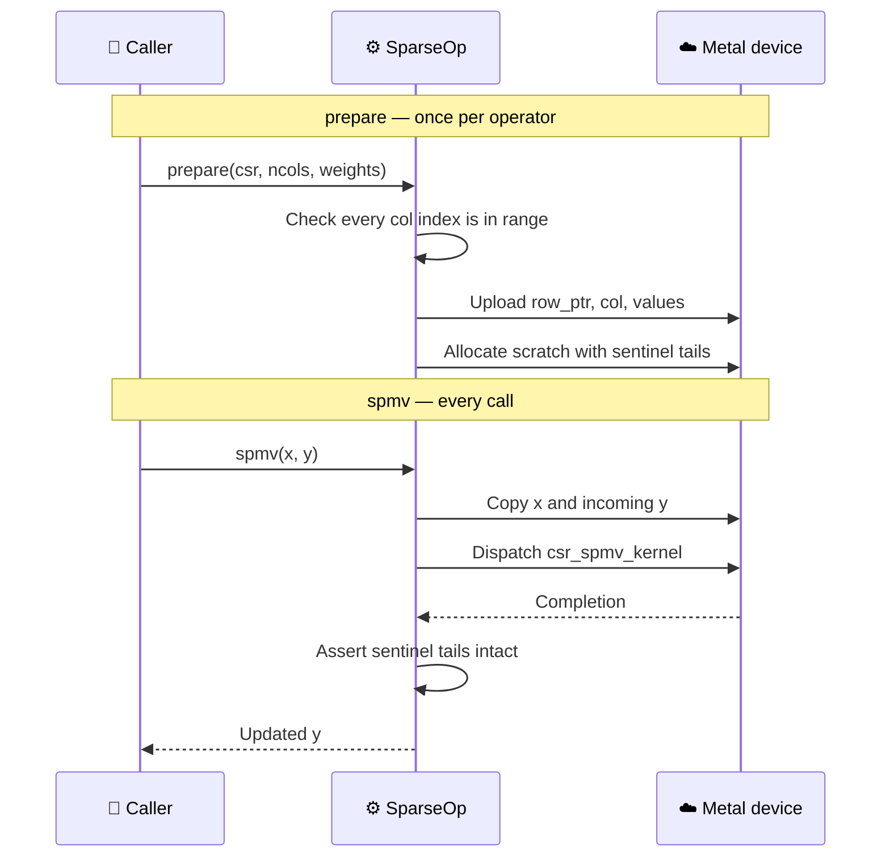
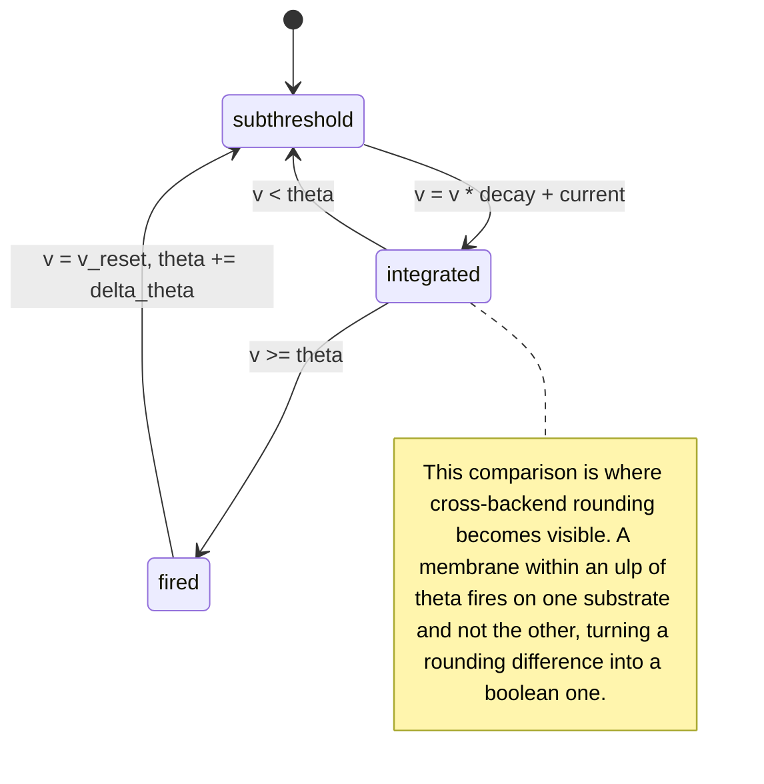

# sparsl

Deterministic sparse and scan compute kernels for event-driven simulation, with fail-closed CPU and GPU backends.

Extracted from the numeric core of a spiking-network research harness. The kernels themselves are small and unglamorous — CSR sparse matrix-vector multiply, a leaky integrate-and-fire membrane update, a chunked prefix scan over affine maps, structure-of-arrays column buffers, a seeded RNG. What the crate is about is the two properties those kernels are held to: **results you can reproduce bit for bit**, and **a backend handle that cannot lie about where it ran**.

| | |
| --- | --- |
| **Status** | `0.1.0` — Metal verified, CUDA declared but unavailable |
| **Tests** | 56 passing; suite verified by a 20-case mutation campaign |
| **Platform** | Any CPU; Metal on macOS behind `--features metal` |
| **License** | MIT OR Apache-2.0 |

---

## 🗂️ Architecture

Every path to a kernel runs through two gates. A `Device` exists only for a substrate that can execute, and a `SparseOp` exists only for connectivity validated against its column count. Neither an unavailable backend nor an unchecked sparse matrix is reachable from the public API — both are error values, not runtime surprises.


| Module | What it holds |
| --- | --- |
| `backend` | `Device`, `SparseOp`, availability, validation, CPU kernels |
| `backend::metal` | Metal device, pipelines, resident buffers, dispatch |
| `backend::cuda` | Why CUDA is declared and never available, and how to land it |
| `sparse` | `Csr` and its `Csc` reverse index |
| `scan` | Chunked prefix scan over affine maps, bit-exact against sequential |
| `simd` | Lane-shaped leak/integrate, no intrinsics, no `unsafe` |
| `buffer`, `rng`, `time` | SoA columns, seeded ChaCha, tick type |

---

## 🛡️ The honesty invariant

`Device::label()` reports the substrate that **executed**, not the one that was requested. There is no fallback: asking for an unavailable backend returns `BackendUnavailable` with a reason.

This is a regression guard, not decoration. The code this crate was extracted from carried a `use_gpu: bool` that no dispatch path ever read. A "GPU" handle and a "CPU" handle ran byte-identical `rayon` code, benchmarks reported roughly 1.00x speedups as genuine cross-substrate results, and generated reports printed CPU timings under a GPU heading.


One gate serves every backend, and that is deliberate. An earlier version gave each backend its own error arm; a mutation replacing one arm's `Err` with a CPU fallback passed the entire test suite, because on a machine where Metal works that arm is unreachable and no test on such a machine can execute it. Untestable code is not made safe by more tests, so the branch was removed rather than covered.

### Backend status

| Backend | Availability | Notes |
| --- | --- | --- |
| `CpuSequential` | Always | The determinism reference |
| `CpuParallel` | Always | Asserted **bit-identical** to sequential, not merely close |
| `Metal` | `--features metal`, macOS, real device | Implemented and verified against the reference |
| `Cuda` | **Never** | No dispatch written; none could be verified on Apple silicon |

`Backend::Cuda` fails closed with a reason and is omitted from `available_backends()`. `src/backend/cuda.rs` carries the steps to land it; the last one is that `tests/differential.rs` fuzzes any backend the moment it reports available, so that flag must not be flipped before the suite passes.

---

## ⚙️ How a dispatch works

Connectivity and weights are uploaded once. Only the input vector and the membrane state cross the boundary per call.



Two decisions in that diagram were forced by measurement rather than taste.

**Weights belong to the operator.** As a per-call argument they forced an 80 MB host-to-device copy before every dispatch on a 20M-non-zero operator, and Metal lost to `rayon` at every size on that copy alone. Moving them onto the operator took the 20,000-row case from 3.03 ms to 1.01 ms.

**Column indices are validated once, then trusted.** The GPU kernels index `x[col[i]]` with no range check, because a bounds check per non-zero costs more than the multiply it guards. That is sound only because `prepare` proves every stored index is in range before a byte is uploaded, and preparing is the only route to a sparse kernel. An out-of-range `Csr` is a rejected `SparsePlanError`, never an out-of-bounds read of device memory.

---

## 🔬 What the kernels compute

Each tick a cell decays its membrane, adds synaptic current, and either stays below threshold or fires — resetting the membrane and raising its own threshold.



That note is the reason the differential suite treats spikes inside a tolerance band around threshold as legitimately ambiguous, and demands exact agreement everywhere else.

---

## 🎯 Reproducibility, and where it stops

Same seed, same backend, same bits. The parallel scan left-folds instead of reassociating specifically so it matches a sequential scan bit for bit, and the two CPU arms are asserted bit-identical. Nothing here autotunes: a kernel picked by runtime benchmark differs per machine, which changes the reduction order, which changes the floats.

Across backends it does not hold. The crate names the three causes rather than implying they do not exist.

| Cause | Effect | Covered by |
| --- | --- | --- |
| Reduction order | GPU and CPU row sums differ in the last ulps | `tolerance_for_nnz_per_row`, the `n · eps · max|term|` bound with margin |
| Multiply-add contraction | Metal fuses `v * decay + current`, rounding once where the CPU rounds twice | `tolerance_for_elementwise`, pinned by `tests/fma_contraction.rs` |
| Threshold proximity | Either of the above can flip a spike, not merely perturb a float | Spike flips permitted only inside the tolerance band |

`CompileOptions::set_fast_math_enabled(false)` does **not** prevent the contraction — that was measured, not assumed. `tests/fma_contraction.rs` requires every non-spiking GPU membrane to match one of the two roundings bit for bit, so the tolerance is sized for an identified cause rather than for an unexplained gap.

`tests/golden.rs` pins the reference's actual output bits. Any change to summation order, iteration order, the RNG, or the LIF update moves the fingerprint — which is exactly the signal that a downstream replay hash has become invalid.

---

## 📦 Usage

```toml
[dependencies]
sparsl = { version = "0.1", features = ["metal"] }
```

```rust
use sparsl::{Backend, Csr, Device, LifParams};

fn main() -> Result<(), Box<dyn std::error::Error>> {
    let csr = Csr::from_adjacency(&[vec![1, 2], vec![0], vec![0, 1]]);
    let weights = vec![1.0, 2.0, 3.0, 4.0, 5.0];

    // Prefer the GPU, but never silently pretend to have one.
    let device = Device::try_new(Backend::Metal).unwrap_or_else(|why| {
        eprintln!("falling back to CPU: {why}");
        Device::cpu_parallel()
    });

    // Validates the CSR against ncols and uploads it once.
    let mut op = device.prepare(&csr, 3, &weights)?;

    let x = vec![0.5, 1.0, 1.5];
    let mut y = vec![0.0; 3];
    op.spmv(&x, &mut y)?;

    let params = LifParams::new(0.9, 0.0, 0.1)?;
    let (mut v, mut theta, mut spikes) = (vec![0.0; 3], vec![1.0; 3], vec![false; 3]);
    op.fused_spmv_lif(&x, &mut v, &mut theta, &mut spikes, params)?;

    // Connectivity is fixed; values move on the timescale of learning.
    op.set_weights(&[1.0, 2.0, 3.0, 4.0, 6.0])?;

    println!("ran on {}", op.label());
    Ok(())
}
```

This snippet is `examples/readme.rs`, built on every check so it cannot drift from the crate. Run it without `--features metal` and it prints the invariant working:

```text
falling back to CPU: backend `Metal GPU` is unavailable: sparsl was built without the `metal` cargo feature
ran on CPU parallel (rayon)
```

---

## 📊 Performance

`cargo run --release --features metal --example crossover` — Apple M5 Pro, CSR at 5% density, milliseconds per SpMV. Fastest arm per row in bold.

| N | nnz | CPU sequential | CPU parallel | Metal |
| ---: | ---: | ---: | ---: | ---: |
| 1,000 | 50K | **0.022** | 0.109 | 0.187 |
| 5,000 | 1.25M | 0.718 | 0.278 | **0.239** |
| 10,000 | 5M | 3.048 | **0.388** | 0.491 |
| 20,000 | 20M | 12.496 | 1.239 | **1.007** |

Read this cautiously. The example exercises every arm before timing any of them — without that ramp the first-timed arm pays for the GPU clock ramp-up and later arms do not, which once produced the physically impossible result that adding a host memcpy per iteration made it faster. It then times each arm twice in opposite orders and reports the spread between passes; the spread here was 1.24 to 1.66, so the `rayon` and Metal ordering at 10,000 rows is inside the noise.

The honest summary: `rayon` wins the middle of the range, Metal pulls ahead at the top by a margin that is not large, and below roughly 5,000 non-zeros per row the sequential arm beats both because neither parallel substrate earns its dispatch overhead.

---

## 🧪 Testing

```bash
cargo test --features metal --release
```

| Suite | Tests | What it holds down |
| --- | ---: | --- |
| Unit (in-crate) | 28 | Scan bit-exactness, CSR/CSC invariants, RNG golden stream, tolerance bounds |
| `honesty` | 6 | Unconstructible unavailable backends, distinct labels, CPU arms bit-identical |
| `differential` | 6 | Every available backend against the CPU reference, boundary shapes plus a proptest fuzz |
| `stress` | 13 | Malformed CSR, out-of-range columns, non-finite data, subnormals, contention, soak |
| `golden` | 2 | The reference's own output bits |
| `fma_contraction` | 1 | That the CPU/GPU gap has exactly one identified cause |

The shape sweep straddles every boundary the backends care about — 31, 32, 33 for the SIMD width and 255, 256, 257 for the threadgroup — plus the degenerate zero-row, zero-edge and single-row cases that a sweep of reasonable sizes never reaches.

### Mutation campaign

All thirteen stress tests passed on their first run, which is precisely when a suite deserves suspicion. Twenty deliberate defects were injected. **Four survived, and each exposed a real gap that was then closed:**

| Surviving mutation | What it exposed | Fix |
| --- | --- | --- |
| Delete the fused kernel's row bounds guard | Out-of-bounds device writes landed in page padding and were invisible | Sentinel tails on every kernel-written buffer, checked after each dispatch |
| Sum each row in reverse | Every check is relative to the reference, so moving the reference moves everything and nothing fails | `tests/golden.rs` pins the reference's bits |
| `try_new(Metal)` falls back to CPU | The error branch is unreachable on a machine that has Metal | One availability gate for all backends, plus a directly tested consistency check |
| Widen a tolerance to `f32::MAX` | A tolerance can fail upward and make an entire suite vacuous | Upper as well as lower bounds asserted on both tolerance formulas |

Re-verification after the fixes: every former survivor is now caught.

---

## 🔗 Relationship to tessl

[`tessl`](https://github.com/bharathvbcr/tessl) is the dense counterpart — a Metal 4 GEMM and encode runtime built on `objc2-metal`, `MTL4` argument tables and TensorOps. `sparsl` is sparse, CPU-first, and uses classic `metal` 0.29 encode.

They are deliberately separate crates. `tessl`'s runtime, dispatch and tensor modules form a general Metal 4 compute runtime that `sparsl` could eventually sit on, but folding sparse SpMV and LIF kernels into a GEMM crate would blur what either one is. If `sparsl` moves to Metal 4, it should depend on that runtime rather than merge into it.

---

## 📚 References

- Mermaid diagrams in this README render natively on GitHub.[^1]
- The recursive summation error bound behind `tolerance_for_nnz_per_row` is standard floating-point analysis.[^2]

[^1]: GitHub Blog. (2022). "Include diagrams in your Markdown files with Mermaid." https://github.blog/2022-02-14-include-diagrams-markdown-files-mermaid/

[^2]: Higham, N. J. (2002). *Accuracy and Stability of Numerical Algorithms*, 2nd ed. SIAM. Chapter 4, "Summation." https://epubs.siam.org/doi/book/10.1137/1.9780898718027
